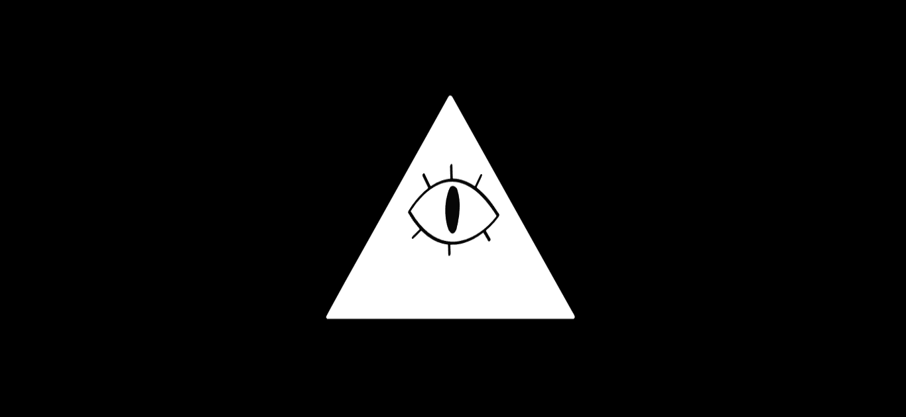

# Happy Mystery :D
<div align="center">
 
</div>

<!-- GETTING STARTED -->
## Getting Started

### Manual Installation

Here are the steps to execute the project:

1. Clone the repo

   ```sh
   git clone git@github.com:sebastianterleira/happy-mystery.git
   ```
   
2. Install NPM packages

   ```sh
   npm install
   ```
   
3. Run the app

   ```sh
   npm run dev
   ```
   
4. To make a build of all apps and packages

   ```sh
   npm run build
   ```
   

<p align="right">(<a href="#readme-top">back to top</a>)</p>
